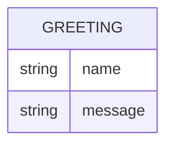

# Domain Model

Greeter has a single conceptual entity: the greeting produced for a given name.

`Greeting` is never persisted — it is computed per request from the `name`
query parameter (or the default name when none is supplied) and returned as
the response body.